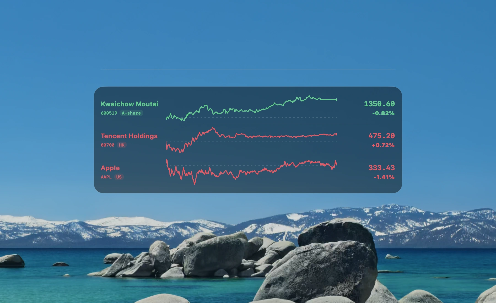
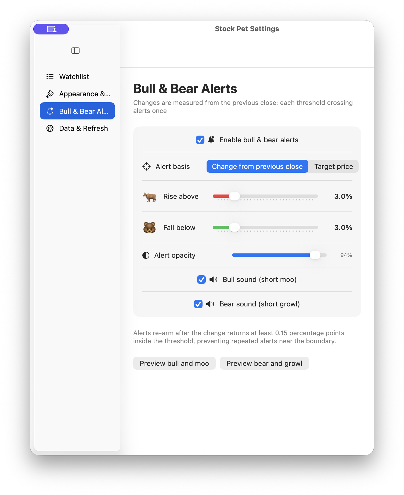
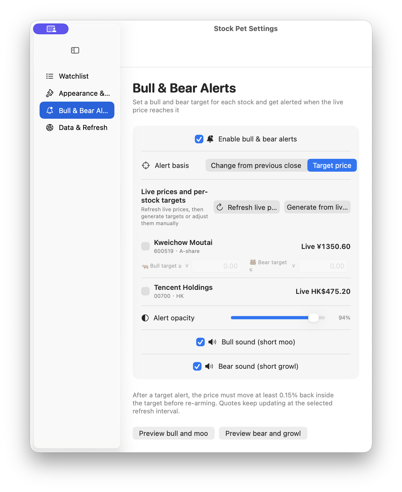
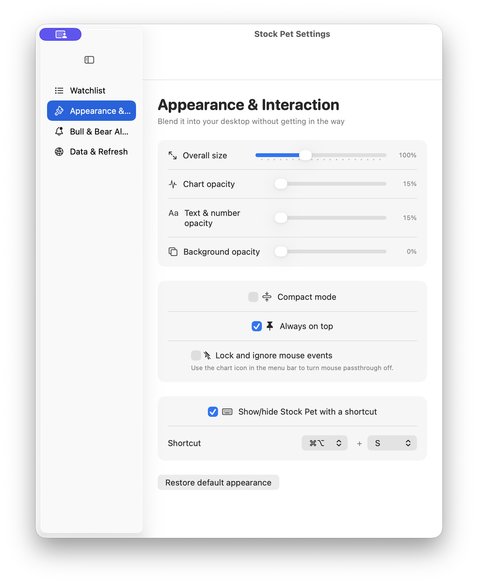
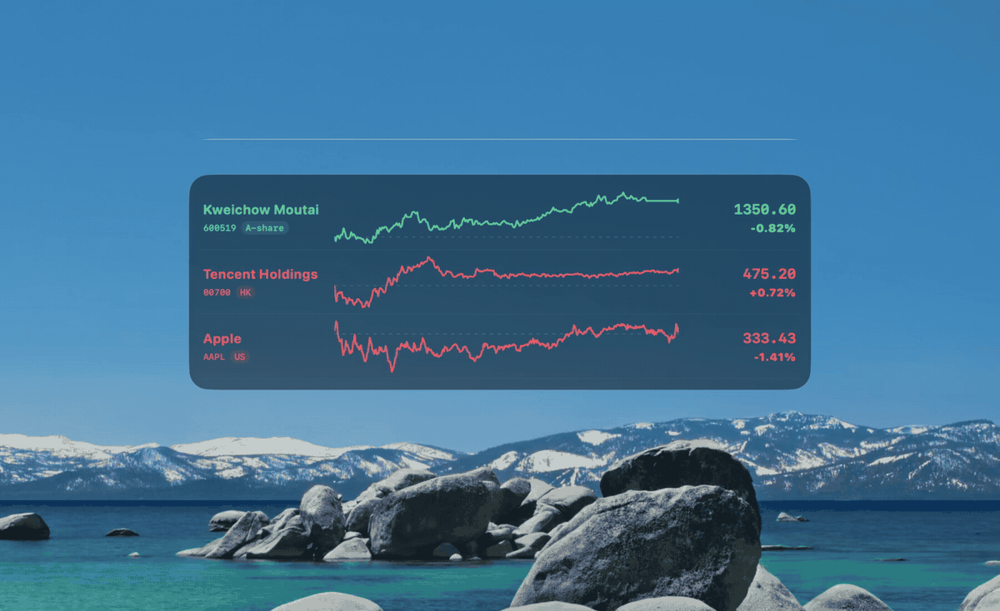

  <strong>English</strong> · <a href="README_ZH.md">简体中文</a>

  

<h1 align="center">Stock Pet</h1>

  <strong>Stay on top of stock price movements while you work—your stock-watching desktop pet</strong>

  
  
  
  
  

  

## Contents

- [Background](#background)
- [Quick Start](#quick-start)
- [Feature Details](#feature-details)
- [Data and Risk Notes](#data-and-risk-notes)

## Background

Keeping a full market app open while working takes up screen space, frequent switching interrupts your flow, and coworkers or managers may easily notice it.

Stock Pet keeps company names, today's intraday charts, latest prices, and percentage changes on the desktop, with support for A-shares, Hong Kong stocks, and US stocks. It stays quiet during normal work and brings out a little bull or bear when an alert condition is met. Scaling, opacity, mouse passthrough, and quick hiding keep market watching from interrupting your work—and make casual checks less noticeable.

## Quick Start

Visit [GitHub Releases](https://github.com/YellowPancake/StockPet/releases/latest) and download the English package for your system:

| System | English package |
| --- | --- |
| macOS 13 or later | `StockPet-macOS-English.zip`, for Apple Silicon and Intel Macs |
| 64-bit Windows 10/11 | `StockPet-Windows-x64-English.zip` |

### macOS

1. Unzip the package and move Stock Pet into Applications.
2. If macOS cannot verify the developer on first launch, confirm it under System Settings → Privacy & Security.
3. Double-click the desktop market panel to open Settings, then search by company name or ticker to add stocks.

### Windows

1. Extract the complete archive, open the extracted folder, and run `StockPet.exe`.
2. Keep `StockPet.exe` together with the adjacent `resources`, `locales`, and DLL files.
3. Double-click the desktop market panel to open Settings, then search by company name or ticker to add stocks.

> These builds are not signed with a commercial code-signing certificate, so the operating system may show a source warning on first launch.

### Get Started in Three Steps

1. **Add stocks:** double-click Stock Pet to open Settings, then search by company name or ticker, such as `Kweichow Moutai`, `00700`, or `AAPL`.
2. **Make it yours:** adjust overall size, chart width, font size, and opacity; show tickers and markets only when you need them.
3. **Put the bull and bear on duty:** set rise and fall thresholds, then choose a convenient show/hide shortcut.

Default shortcut:

| Platform | Show / hide Stock Pet |
| --- | --- |
| macOS | `⌘ + ⌥ + S` |
| Windows | `Ctrl + Alt + S` |

## Feature Details

### Desktop View: Quiet While You Work

  

- Watch A-shares, Hong Kong stocks, and US stocks together, with no watchlist limit.
- Every stock has a real intraday chart, with the name on the left and the latest price and percentage change on the right.
- A-shares and Hong Kong stocks use red for gains and green for losses; US stocks use the opposite convention.
- Stock names are larger by default; tickers and markets can be shown when needed.
- Names, prices, percentage changes, and charts share the same movement color, with independent font-size and horizontal chart-width controls.
- Long watchlists scroll inside the pet instead of making the window grow indefinitely.
- Latest prices, percentage changes, and alerts can refresh as often as once per second; intraday charts use a separate, lighter schedule and update no faster than every 15 seconds.

### Bull & Bear Threshold Alerts: They Arrive When Needed

  

- Choose alerts based on the latest price versus the previous close, or set individual bull and bear target prices for each stock.
- Target-price mode shows the latest quote for every watchlist stock. Generate upper and lower targets from the current price, then fine-tune them manually.
- A little bull appears when the price crosses the rise threshold or bull target; a little bear appears when it crosses the fall threshold or bear target.
- Bull and bear sounds have separate switches, and all alerts can be disabled with one master switch.
- Alert opacity is adjustable independently.
- Each crossing alerts once. The price must return inside the threshold before the alert re-arms, preventing repeated alerts around the boundary.

  

For example, with a `+3.0%` rise threshold: the first touch at `+3.0%` alerts; a pullback below `+2.85%` re-arms it; only a new move to `+3.0%` alerts again.

### Low-Profile Privacy Controls: Blend In or Hide Instantly

  

  

- **Overall scale:** resize the watchlist, charts, and panel together from `65%` to `160%`.
- **Chart and text sizing:** adjust the chart's horizontal width and font size independently.
- **Optional ticker and market:** hidden by default to give the larger stock name more room.
- **Three opacity controls:** tune charts, text and numbers, and the background independently.
- **Drag anywhere:** keep it wherever it feels least distracting.
- **Double-click Settings:** double-click the panel or a chart to open Settings.
- **Global show/hide shortcut:** enable it, disable it, or choose a different key combination.
- **Mouse passthrough:** lock the pet so it never blocks clicks or scrolling below it.
- **Always on top:** keep the market at the edge of your view while switching apps.

**A coworker or manager glancing at your screen is far less likely to see a conspicuous trading window, making casual market checks much less awkward.**

### Feature Overview

| Feature | What it does |
| --- | --- |
| Three markets | Search and add A-shares, Hong Kong stocks, and US stocks |
| Unlimited watchlist | Add, remove, and reorder stocks; long lists scroll |
| Real intraday charts | Displays minute data and never invents a chart |
| Market-aware colors | A-shares / Hong Kong: red up and green down; US: green up and red down |
| Appearance controls | Overall scale, chart width, font size, ticker/market visibility, and three independent opacity controls |
| Desktop interaction | Drag, double-click Settings, always on top, and mouse passthrough |
| Quick hiding | Customizable global shortcut to show or hide the pet |
| Bull & bear alerts | Previous-close percentages or per-stock targets, live-price target generation, master switch, opacity, and sounds |
| Anti-repeat logic | Re-arms after the price returns inside the threshold |
| Fast quote refresh | Optional 1-second batch quotes for latest prices, changes, and alerts; charts update separately at 15 seconds or slower |
| Software updates | Checks for a newer version through two independent routes, downloads the matching language/system package, verifies its SHA-256 digest, then shows it in Downloads |
| Data resilience | Tencent fast quotes and intraday data, Eastmoney fallback, adaptive backoff, and stale-data marking on failure |
| Cross-platform | Universal macOS and Windows x64 |

## Data and Risk Notes

- Search covers A-shares, Hong Kong stocks, and US stocks.
- Tencent fast quotes and intraday data are the primary sources; Eastmoney is the intraday fallback.
- The selected refresh interval controls latest prices, percentage changes, and alerts. Intraday charts update no faster than every 15 seconds. Outside likely market hours the app slows requests automatically, and repeated failures use progressive backoff.
- The `1 second` option is a request interval, not a guarantee that exchanges or public endpoints publish a new trade every second.
- Software Update downloads the package only after you choose to do so. It verifies the SHA-256 digest published by GitHub and reveals the file in Downloads; it does not silently replace the running app.
- A failed request never creates a random or simulated chart. The last successful result may remain visible and is marked stale.
- Real-time entitlements for Hong Kong and US markets are subject to exchange rules. Public quote endpoints may be delayed, rate-limited, or changed.

> [!CAUTION]
> Stock Pet is a personal market-viewing aid, not investment advice and not a trading-data service. Public web quotes are not guaranteed to be real-time, complete, or accurate. You remain responsible for every investment decision and outcome.

To report a problem, open an [Issue](https://github.com/YellowPancake/StockPet/issues) without including account, trading, or other sensitive information. Stock Pet is released under the [MIT License](LICENSE).
