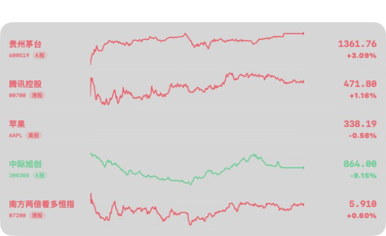
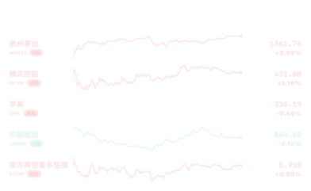
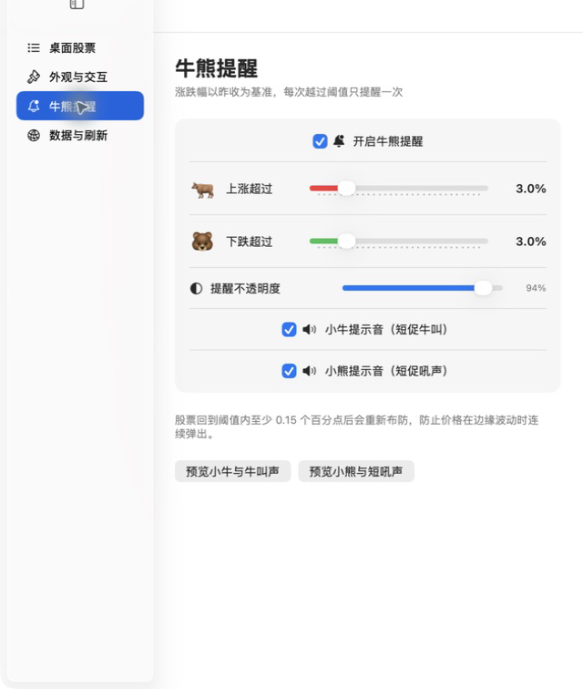
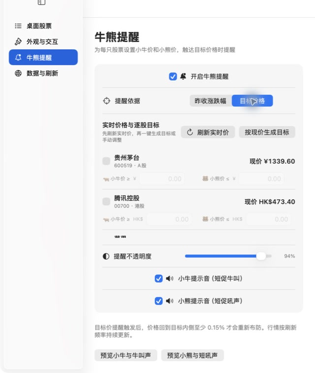
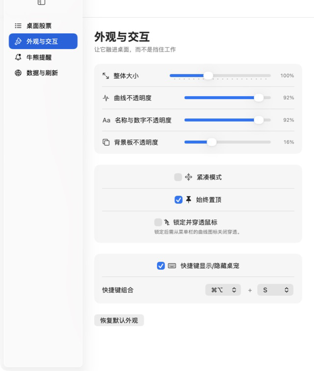
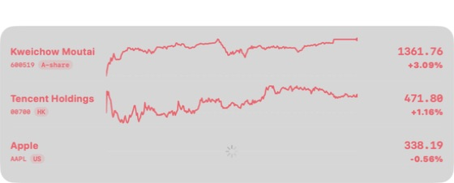
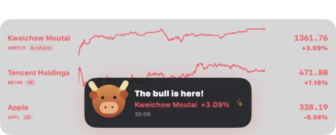
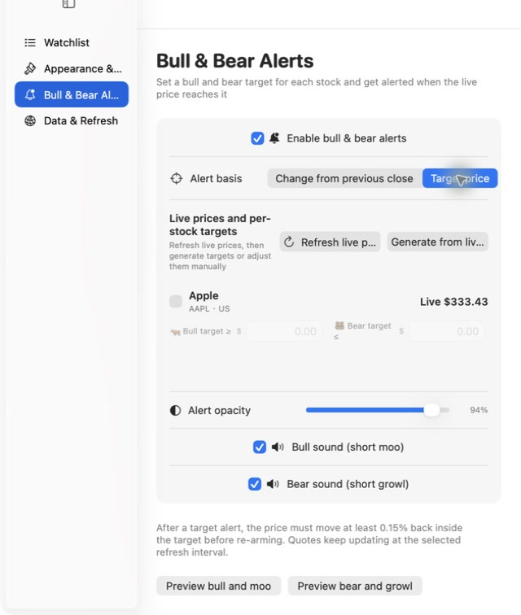
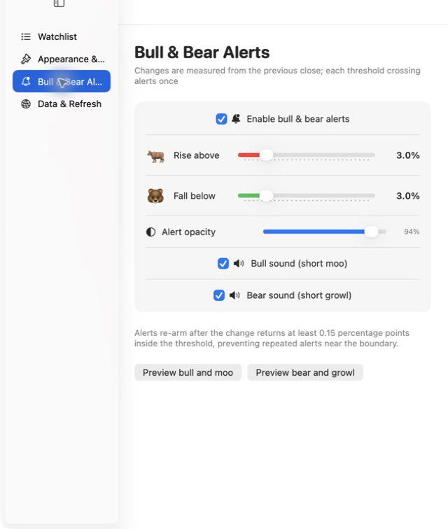
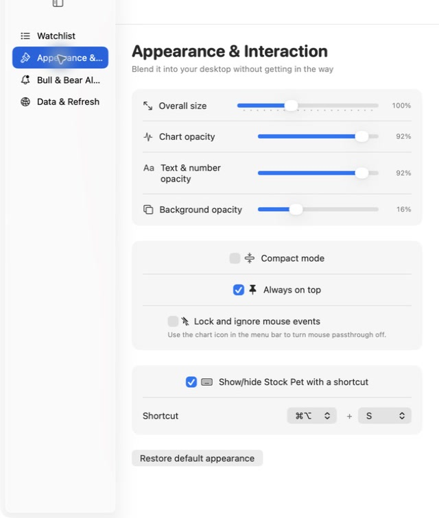

<p align="center">
  
</p>

<h1 align="center">盘宠 StockPet</h1>

<p align="center">
  <strong>把行情养在桌面上。 Keep the market on your desktop.</strong><br>
  分时线安静趴着，该提醒时，小牛小熊会自己来。<br>
  Quiet charts while you work; a little bull or bear appears when it matters.
</p>

<p align="center">
  <a href="#中文">中文</a> · <a href="#english">English</a>
</p>

<p align="center">
  
  
  
  
</p>

<p align="center">
  
</p>

---

<a id="中文"></a>

## 中文

### 为什么会有盘宠？

工作时没法一直开着完整行情软件：窗口占地方，来回切换打断节奏，一直盯着也做不了别的事。

盘宠把真正想看的东西——股票名称、当日分时线、最新价和涨跌幅——留在桌面角落。你可以分别调低曲线、文字和背景板的不透明度，让行情淡淡融进桌面；同事或老板从身边经过时，不会一眼看到一个醒目的看盘窗口，少一点被撞见摸鱼的尴尬。它还能缩小、拖到顺眼的位置，甚至让鼠标直接穿过去。需要专心或共享屏幕时，一组快捷键就能让它暂时消失。

它的目标不是让你一直盯盘，而是让你不必一直盯盘。

### 平时，它安安静静

<table>
  <tr>
    <td width="58%" align="center">
      
    </td>
    <td width="42%" align="center">
      
    </td>
  </tr>
  <tr>
    <td align="center"><sub>想看清楚时，信息完整展开</sub></td>
    <td align="center"><sub>想低调一点时，淡淡留在桌面</sub></td>
  </tr>
</table>

- 同时查看 A 股、港股和美股，股票数量不设上限。
- 每只股票一条真实的当日分时曲线，左侧名称，右侧价格与涨跌幅。
- A 股、港股红涨绿跌；美股绿涨红跌。
- 股票名称、代码、市场、价格、涨跌幅与曲线保持同一涨跌色。
- 股票较多时直接在桌宠内滚动，不会无限撑高窗口。

### 需要时，牛牛和小熊会来

<p align="center">
  
</p>

- 支持两种提醒依据：按“最新价相对昨收的涨跌幅”，或为每只股票单独设置“小牛目标价 / 小熊目标价”。
- 目标价模式会实时显示自选股最新价，可刷新后按现价一键生成上下目标，也可逐只修改。
- 越过涨幅或小牛目标价时，小牛从行情板底部冒出来；跌破阈值或小熊目标价时，小熊会来敲警钟。
- 牛叫和熊叫可以分别开启或关闭，整个牛熊提醒也有总开关。
- 提醒卡片有独立的不透明度设置。
- 同一次越界只提醒一次；涨跌幅回到阈值内至少 `0.15` 个百分点后才会重新布防，避免在边缘反复弹出。

<p align="center">
  
</p>

例如上涨阈值设为 `+3.0%`：首次达到 `+3.0%` 时提醒；回落到 `+2.85%` 以下后重新布防；再次达到 `+3.0%` 时才会再次提醒。

### 融进桌面，也能随时收起来

<p align="center">
  
</p>

- **整体缩放**：从 `65%` 到 `160%`，股票、曲线和背景板一起变化。
- **三组不透明度**：曲线、名称与数字、背景板分别调节。
- **拖拽摆放**：放在桌面上任何顺眼的位置。
- **双击设置**：双击行情板或曲线即可打开设置。
- **快捷显示 / 隐藏**：全局快捷键可以开启、关闭和重新组合。
- **锁定并穿透鼠标**：不挡住下面窗口的点击和滚动。
- **始终置顶**：切换工作窗口时，行情仍留在视线边缘。

默认快捷键：

| 平台 | 显示 / 隐藏桌宠 |
| --- | --- |
| macOS | `⌘ + ⌥ + S` |
| Windows | `Ctrl + Alt + S` |

### 功能一览

| 能力 | 说明 |
| --- | --- |
| 多市场行情 | 搜索并添加 A 股、港股、美股 |
| 不限自选股数量 | 可添加、删除、排序；长列表支持滚动 |
| 当日分时曲线 | 展示真实分钟数据，不生成假曲线 |
| 市场配色 | A/H 红涨绿跌，美股绿涨红跌 |
| 外观控制 | 整体缩放，三组不透明度独立调节 |
| 桌面交互 | 拖拽、双击设置、始终置顶、鼠标穿透 |
| 快捷隐藏 | 可自定义全局快捷键，一键显示或隐藏 |
| 牛熊提醒 | 昨收涨跌幅或逐股目标价、实时价生成目标、总开关、不透明度、独立声音 |
| 防重复提醒 | `0.15` 个百分点滞回重布防 |
| 行情容错 | 腾讯分时为主，东方财富备用；失败时标记过期数据 |
| 跨平台 | macOS Universal、Windows x64；各有中英文版 |

### 下载与安装

请前往 [GitHub Releases](https://github.com/YellowPancake/StockPet/releases/latest) 下载对应压缩包：

| 文件 | 语言与设备 |
| --- | --- |
| `StockPet-macOS-Chinese.zip` | 中文；Apple 芯片与 Intel 芯片 Mac |
| `StockPet-Windows-x64-Chinese.zip` | 中文；Windows 10/11 64 位 |
| `StockPet-macOS-English.zip` | English；Apple 芯片与 Intel 芯片 Mac |
| `StockPet-Windows-x64-English.zip` | English；Windows 10/11 64 位 |

macOS：解压后把应用拖到“应用程序”。首次启动如果提示无法验证开发者，请到“系统设置 → 隐私与安全性”确认打开。系统要求 macOS 14 或更高版本。

Windows：完整解压后进入文件夹并双击 `StockPet.exe`。不要只把 EXE 单独移走，它需要同目录的 `resources`、`locales` 和 DLL 文件。系统要求 Windows 10/11 64 位。

> 当前发布包未使用商业代码签名证书，因此系统首次打开时可能显示来源提醒。

### 三步开始

1. **添加股票**：双击桌宠进入设置，搜索名称或代码，例如 `贵州茅台`、`00700`、`AAPL`。
2. **调成喜欢的样子**：设置大小、曲线不透明度、名称与数字不透明度、背景板不透明度。
3. **交给牛熊值班**：设置上涨和下跌阈值，再选一组顺手的显示 / 隐藏快捷键。

### 数据与风险说明

- 股票搜索覆盖 A 股、港股和美股。
- 腾讯分时行情为主数据源，东方财富作为故障备用。
- 刷新频率可在设置中调整。
- 接口失败时不会绘制随机或模拟曲线；有成功数据时会保留最后一次结果并标记为过期。
- 港股、美股的实时权限受交易所授权规则约束，公开行情可能存在延迟、限流或调整。

> [!CAUTION]
> 盘宠仅用于个人辅助查看行情，不构成投资建议，也不应作为下单依据。公开网页行情不保证交易级实时性、完整性或准确性。任何投资决策及其结果由使用者自行承担。

<details>
<summary><strong>能添加超过 10 只股票吗？</strong></summary>

可以。盘宠不限制股票数量；桌宠和搜索结果都支持上下滚动。股票很多时，刷新请求数量也会相应增加。

</details>

<details>
<summary><strong>为什么到达阈值后没有连续提醒？</strong></summary>

这是有意的防打扰设计。触发一次后，涨跌幅需要先回到阈值内至少 `0.15` 个百分点，盘宠才会重新布防。

</details>

---

<a id="english"></a>

## English

### Why Stock Pet?

Keeping a full trading app open at work takes space, interrupts your flow, and still tempts you to stare at it.

Stock Pet leaves only the useful pieces on your desktop: the company name, today's intraday chart, latest price, and percentage change. Independently lower the opacity of charts, text, and the background so the market quietly blends into your desktop—making it much less awkward when a coworker or manager happens to glance at your screen. You can also resize it, drag it into a quiet corner, or let mouse clicks pass straight through. When you need a clean screen or start sharing, one shortcut hides it instantly.

The point is not to make you watch the market all day. It is to make sure you do not have to.

### Quiet while you work

<p align="center">
  
</p>

- Watch A-shares, Hong Kong stocks, and US stocks together, with no watchlist limit.
- Every stock has a real intraday chart, with the name on the left and price and change on the right.
- A-shares and Hong Kong stocks use red for gains and green for losses; US stocks use the opposite convention.
- Names, tickers, markets, prices, percentage changes, and charts all share the same movement color.
- Long watchlists scroll inside the pet instead of growing forever.

### The bull and bear know when to interrupt

<p align="center">
  
</p>

- Choose between change from the previous close and per-stock target prices.
- Target-price mode shows the latest live quote for every watchlist candidate. Refresh once to generate upper and lower targets from the current price, then fine-tune each stock manually.
- A cartoon bull or bear pops up when a stock crosses its percentage threshold or target price.
- Bull and bear sounds have independent switches, and all alerts can be disabled with one master switch.
- Alert opacity is adjustable on its own.
- Each crossing alerts once. The alert re-arms only after the change moves at least `0.15` percentage points back inside the threshold, preventing chatter around the boundary.

<p align="center">
  
</p>

For example, with a `+3.0%` rise threshold: the first touch at `+3.0%` alerts; a pullback below `+2.85%` re-arms it; only a new move to `+3.0%` alerts again.

<p align="center">
  
</p>

### Blend in, then disappear in one keystroke

<p align="center">
  
</p>

- **Overall scale:** resize the watchlist, charts, and panel together from `65%` to `160%`.
- **Three opacity controls:** tune charts, text and numbers, and the background independently.
- **Drag anywhere:** keep it wherever it feels least distracting.
- **Double-click settings:** double-click the panel or a chart to open Settings.
- **Global show / hide shortcut:** enable it, disable it, or choose a different combination.
- **Mouse passthrough:** lock the pet so it never blocks clicks or scrolling below it.
- **Always on top:** keep the market at the edge of your view while switching apps.

Default shortcut:

| Platform | Show / hide Stock Pet |
| --- | --- |
| macOS | `⌘ + ⌥ + S` |
| Windows | `Ctrl + Alt + S` |

### Feature overview

| Feature | What it does |
| --- | --- |
| Three markets | Search and add A-shares, Hong Kong stocks, and US stocks |
| Unlimited watchlist | Add, remove, and reorder stocks; long lists scroll |
| Real intraday charts | Displays minute data and never invents a fake curve |
| Market-aware colors | A/H: red up, green down; US: green up, red down |
| Appearance controls | Overall scale plus three independent opacity settings |
| Desktop interaction | Drag, double-click Settings, always-on-top, and mouse passthrough |
| Quick hiding | Customizable global shortcut to show or hide the pet |
| Bull & bear alerts | Previous-close percentages or per-stock targets, live-price generation, master switch, opacity, and sounds |
| Anti-repeat logic | Re-arms with `0.15` percentage-point hysteresis |
| Data resilience | Tencent primary, Eastmoney fallback, stale-data marking on failure |
| Cross-platform | Universal macOS and Windows x64, each in Chinese and English |

### Downloads and installation

Download one of the four packages from [GitHub Releases](https://github.com/YellowPancake/StockPet/releases/latest):

| File | Language and platform |
| --- | --- |
| `StockPet-macOS-Chinese.zip` | Chinese; Apple Silicon and Intel Macs |
| `StockPet-Windows-x64-Chinese.zip` | Chinese; 64-bit Windows 10/11 |
| `StockPet-macOS-English.zip` | English; Apple Silicon and Intel Macs |
| `StockPet-Windows-x64-English.zip` | English; 64-bit Windows 10/11 |

macOS: unzip the package and drag the app into Applications. If macOS cannot verify the developer on first launch, confirm it under System Settings → Privacy & Security. Requires macOS 14 or later.

Windows: extract the entire archive, open its folder, and run `StockPet.exe`. Do not move the EXE out by itself; it needs the adjacent `resources`, `locales`, and DLL files. Requires 64-bit Windows 10 or 11.

> These builds are not signed with a commercial code-signing certificate, so the operating system may show a source warning on first launch.

### Three-step setup

1. **Add stocks:** double-click the pet, then search by company name or ticker, such as `Kweichow Moutai`, `00700`, or `AAPL`.
2. **Make it yours:** adjust overall size and the separate chart, text/number, and background opacity controls.
3. **Put the animals on duty:** choose rise and fall thresholds and a convenient show / hide shortcut.

### Data and risk notes

- Search covers A-shares, Hong Kong stocks, and US stocks.
- Tencent intraday quotes are the primary source; Eastmoney is the fallback.
- Refresh frequency is configurable.
- A failed request never creates a random or simulated chart. The last successful result may remain visible and is marked stale.
- Real-time entitlements for Hong Kong and US markets are subject to exchange rules. Public quote endpoints may be delayed, rate-limited, or changed.

> [!CAUTION]
> Stock Pet is a personal market-viewing aid, not investment advice and not a trading-data service. Public web quotes are not guaranteed to be real-time, complete, or accurate. You remain responsible for every investment decision and outcome.

<details>
<summary><strong>Can I add more than 10 stocks?</strong></summary>

Yes. Stock Pet has no watchlist limit, and both the desktop list and search results can scroll. Larger watchlists also create more refresh requests.

</details>

<details>
<summary><strong>Why does an alert not repeat continuously at the threshold?</strong></summary>

That is intentional. After one alert, the percentage change must return at least `0.15` points inside the threshold before Stock Pet re-arms it.

</details>

---

## Development / 本地开发

macOS native app / macOS 原生版（SwiftUI + AppKit）：

```bash
xcodegen generate
xcodebuild -project StockPet.xcodeproj -scheme StockPet -configuration Debug build
xcodebuild -project StockPet.xcodeproj -scheme StockPet test
xcodebuild -project StockPet.xcodeproj -scheme StockPetEnglish test
```

Windows core tests / Windows 核心逻辑测试：

```bash
node --test windows/test/*.test.js
node --test windows-english/test/*.test.js
```

```text
StockPet/              macOS shared source / macOS 共用源码
ChineseResources/      macOS Chinese resources / 中文资源
EnglishResources/      macOS English resources / 英文资源
StockPetTests/         macOS Chinese tests / 中文版测试
StockPetEnglishTests/  macOS English tests / 英文版测试
windows/               Windows Chinese app / Windows 中文版
windows-english/       Windows English app / Windows 英文版
docs/assets/           README media / README 素材
dist/                  Local packages / 本地安装包
```

## Feedback / 反馈

遇到问题请提交 [Issue](https://github.com/YellowPancake/StockPet/issues)，并尽量附上系统版本、股票代码和复现步骤；请勿上传账户、交易或其他敏感信息。

Open an [Issue](https://github.com/YellowPancake/StockPet/issues) with your operating system, ticker, and reproduction steps. Please do not upload account, trading, or other sensitive information.

## License / 许可证

本项目采用 [MIT License](LICENSE)。

Stock Pet is released under the [MIT License](LICENSE).

---

<p align="center">
  <strong>盘宠不是让你一直盯盘，而是让你不必一直盯盘。</strong><br>
  <strong>Stock Pet is here so you do not have to keep watching.</strong>
</p>
