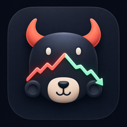
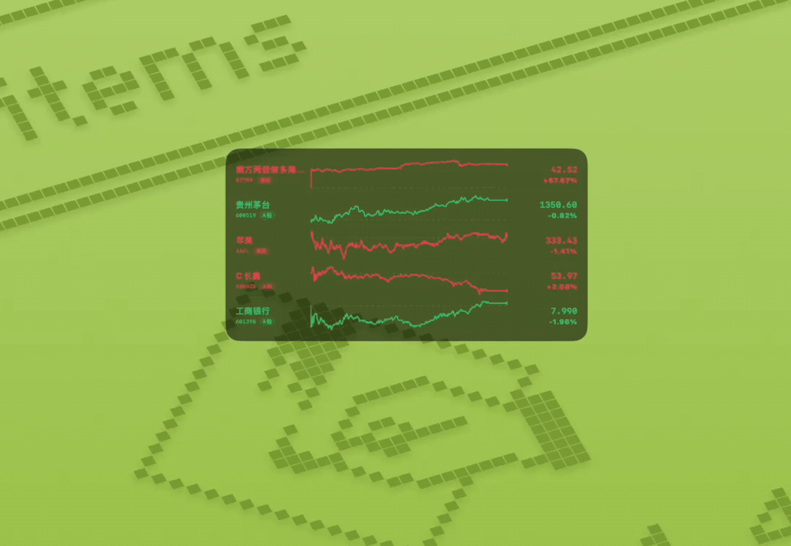
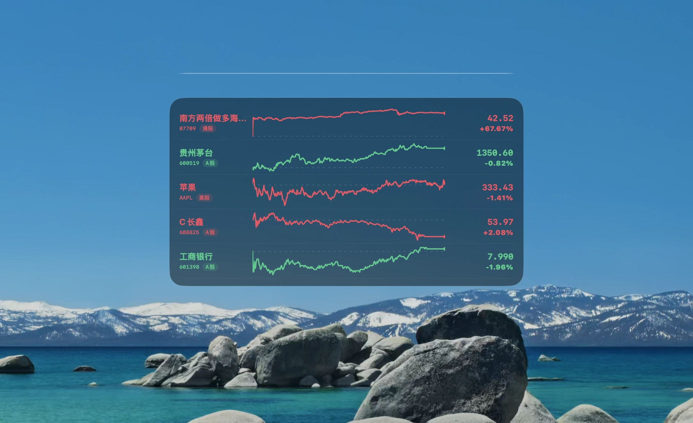
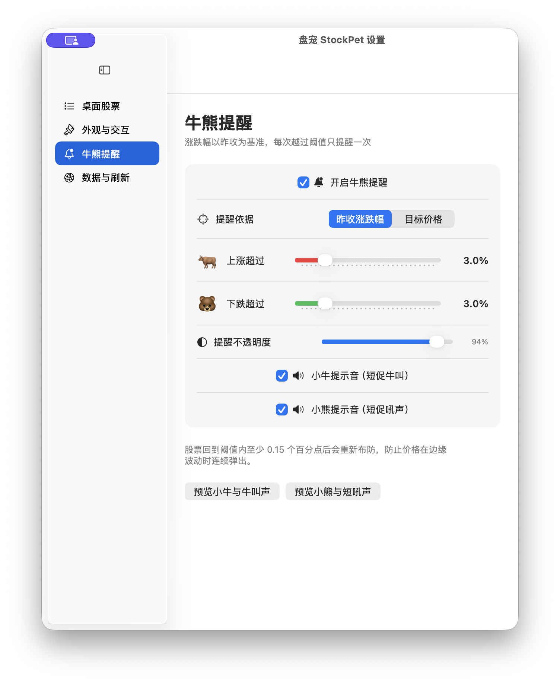
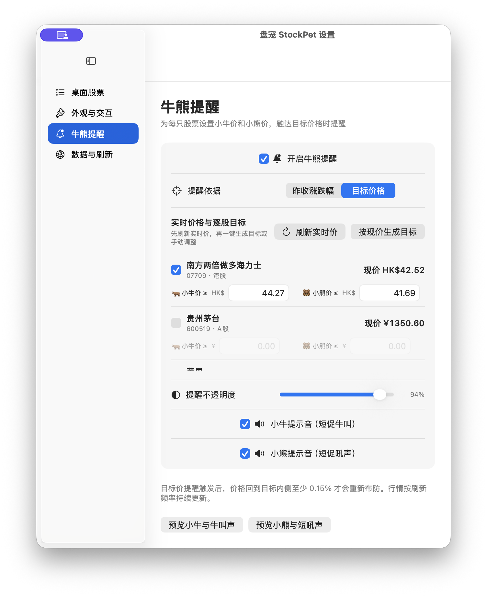
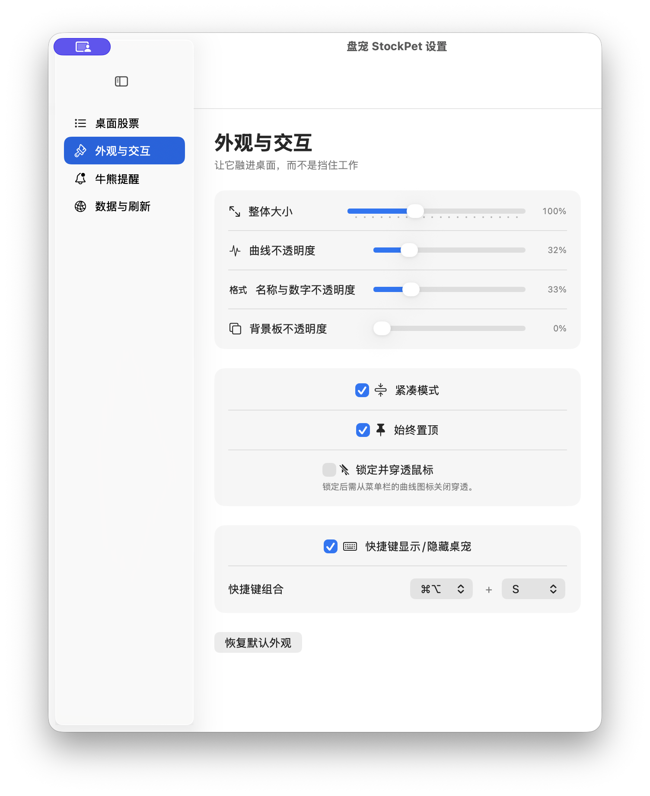
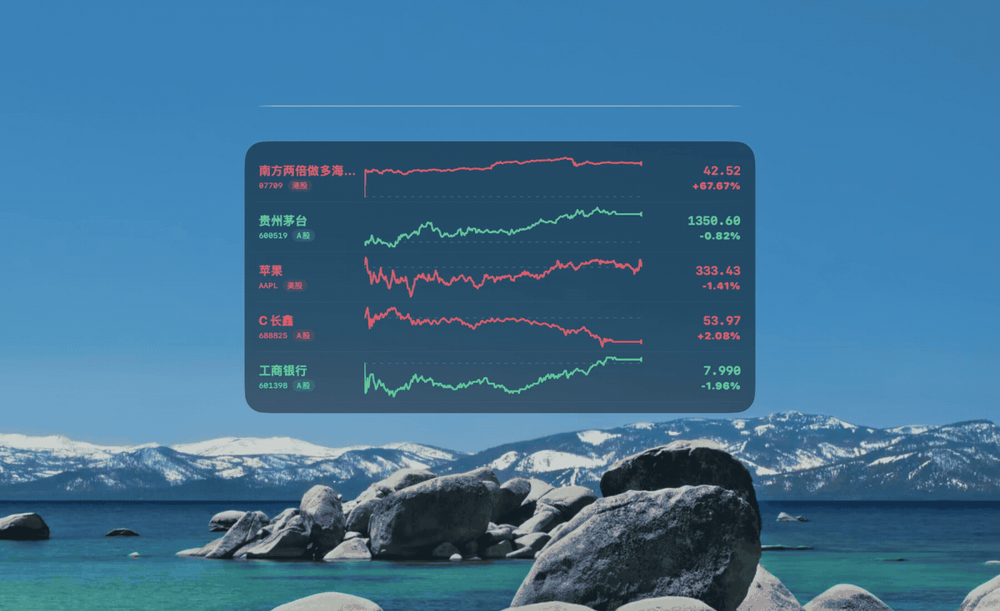

  <a href="README.md">English</a> · <strong>简体中文</strong>

  

<h1 align="center">盘宠 StockPet</h1>

  <strong>工作时也能及时关注股价变化，你的股票盯盘桌宠</strong>

  
  
  
  
  

  

## 目录

- [背景介绍](#背景介绍)
- [快速开始](#快速开始)
- [功能详解](#功能详解)
- [数据与风险说明](#数据与风险说明)

## 背景介绍

在电脑前工作时，很难一直开着完整的行情软件：窗口占地方，频繁切换会打断工作节奏，还容易被同事/老板看到……

盘宠把股票名称、当日分时线、最新价和涨跌幅留在桌面上，支持 A 股、港股和美股。平时它安静展示行情，触及设定条件时再由小牛或小熊提醒；同时提供缩放、不透明度、鼠标穿透和快捷隐藏等设置，让看盘不打扰工作（摸鱼不被发现）。

## 快速开始

前往 [GitHub Releases](https://github.com/YellowPancake/StockPet/releases/latest)，根据电脑系统下载中文安装包：

| 系统 | 中文安装包 |
| --- | --- |
| macOS 14 或更高版本 | `StockPet-macOS-Chinese.zip`，支持 Apple 芯片与 Intel 芯片 |
| Windows 10/11 64 位 | `StockPet-Windows-x64-Chinese.zip` |

### macOS

1. 解压 ZIP，将盘宠拖入“应用程序”文件夹。
2. 首次启动若提示无法验证开发者，请前往“系统设置 → 隐私与安全性”确认打开。
3. 双击桌面行情区域打开设置，搜索名称或代码添加股票。

### Windows

1. 完整解压 ZIP，进入解压后的文件夹并双击 `StockPet.exe`。
2. 请保留 `StockPet.exe` 与同目录的 `resources`、`locales` 和 DLL 文件。
3. 双击桌面行情区域打开设置，搜索名称或代码添加股票。

> 当前发布包未使用商业代码签名证书，因此系统首次打开时可能显示来源提醒。

### 三步开始

1. **添加股票**：双击桌宠进入设置，搜索名称或代码，例如 `贵州茅台`、`00700`、`AAPL`。
2. **调成喜欢的样子**：设置整体大小、曲线横向宽度、字体大小和各项不透明度；需要时再显示股票代码与市场。
3. **交给牛熊值班**：设置上涨和下跌阈值，再选一组顺手的显示 / 隐藏快捷键。

默认快捷键：

| 平台 | 显示 / 隐藏桌宠 |
| --- | --- |
| macOS | `⌘ + ⌥ + S` |
| Windows | `Ctrl + Alt + S` |

## 功能详解

### 桌面状态：平时，它安安静静

  

- 同时查看 A 股、港股和美股，自选股数量不设上限。
- 每只股票展示真实的当日分时曲线，左侧为名称，右侧为最新价与所选涨跌显示。
- A 股、港股红涨绿跌；美股绿涨红跌。
- 默认只显示更醒目的股票名称；股票代码与市场可按需开启。
- 名称、价格、涨跌与曲线保持同一涨跌色；涨跌可选择百分比或涨跌额，字体大小和曲线的横向显示宽度可独立调整。
- 股票较多时可直接在桌宠内上下滚动。
- 最新价、涨跌幅和牛熊提醒最快可按 1 秒刷新；分时曲线采用独立的轻量节奏，最快每 15 秒更新一次。

### 牛熊阈值提醒：需要时，牛牛和小熊会来

  

- 支持按“最新价相对昨收的涨跌幅”提醒，也支持为每只股票设置“小牛目标价 / 小熊目标价”。
- 目标价模式会实时显示自选股最新价，可按现价一键生成上下目标，也可以逐只修改。
- 越过上涨阈值或小牛目标价时，小牛会冒出来；跌破下跌阈值或小熊目标价时，小熊会出现。
- 牛叫与熊叫可以分别开启或关闭，整个牛熊提醒也可以一键关闭。
- 提醒卡片可独立调节不透明度。
- 每次越界只提醒一次；价格回到阈值内侧后才会重新布防，避免在边缘反复提醒。

  

例如上涨阈值设为 `+3.0%`：首次达到 `+3.0%` 时提醒；回落到 `+2.85%` 以下后重新布防；再次达到 `+3.0%` 时才会再次提醒。

### 摸鱼隐私设置：融进桌面，也能随时收起来

  

  

- **整体缩放**：从 `65%` 到 `160%`，股票、曲线和背景板一起变化。
- **曲线与字体尺寸**：曲线所占的横向宽度和字体大小可以分别调整。
- **代码与市场按需显示**：默认隐藏，让更大的股票名称占据原有标签空间。
- **三组不透明度**：曲线、名称与数字、背景板分别调节。
- **拖拽摆放**：放在桌面上任何顺眼的位置。
- **双击设置**：双击行情板或曲线即可打开设置。
- **快捷显示 / 隐藏**：全局快捷键可以开启、关闭和重新组合。
- **定时显示 / 隐藏**：可按电脑本地时间设置每天自动显示与隐藏，例如 `09:30` 显示、`15:30` 隐藏。
- **锁定并穿透鼠标**：不挡住下方窗口的点击和滚动。
- **始终置顶**：切换工作窗口时，行情仍留在视线边缘。

**同事或老板从身边经过时，不会一眼看到一个醒目的看盘窗口，少一点被撞见摸鱼的尴尬。**

### 功能一览

| 能力 | 说明 |
| --- | --- |
| 多市场股票与指数 | 搜索并添加 A 股、港股、美股，以及上证指数、恒生指数、纳斯达克等主要指数 |
| 不限自选股数量 | 可添加、删除、排序，长列表支持滚动 |
| 当日分时曲线 | 展示真实分钟数据，不生成虚构曲线 |
| 市场配色 | A 股 / 港股红涨绿跌，美股绿涨红跌 |
| 涨跌显示 | 桌面可在百分比与相对昨收的涨跌额之间切换 |
| 外观控制 | 整体缩放、曲线横向宽度、字体大小、代码与市场显隐，以及三组独立不透明度 |
| 桌面交互 | 拖拽、双击设置、始终置顶、鼠标穿透 |
| 快捷隐藏 | 自定义全局快捷键，一键显示或隐藏 |
| 定时显隐 | 每天按可编辑的本地时间自动显示和隐藏桌宠 |
| 牛熊提醒 | 昨收涨跌幅或逐股目标价、实时价生成目标、总开关、不透明度和声音 |
| 防重复提醒 | 回到阈值内侧后重新布防 |
| 秒级行情刷新 | 最新价、涨跌幅和提醒可选 1 秒批量刷新；分时曲线独立按 15 秒或更慢频率更新 |
| 软件更新 | 通过两条独立路线检查新版本，下载当前语言与系统对应的安装包，校验 SHA-256 后在下载目录中显示 |
| 行情容错 | 腾讯秒级报价与分时为主、东方财富备用，失败自动退避并标记过期数据 |
| 跨平台 | macOS Universal 与 Windows x64 |

## 数据与风险说明

- 搜索覆盖 A 股、港股、美股及这些市场的主要指数。
- 股票以腾讯秒级报价与分时行情为主；指数保留东方财富的市场标识并使用指数行情通道，避免同代码股票与指数混淆。
- 所选刷新频率用于最新价、涨跌幅和牛熊提醒；分时曲线最快每 15 秒更新一次。非交易时段会自动降频，连续失败时会逐步延长重试间隔。
- `1 秒`表示请求间隔，不代表交易所或公开接口每秒都会产生并返回一笔新成交。
- 软件更新只会在你主动点击后下载安装包，并校验发布时记录的 SHA-256；下载完成后会显示文件位置，不会静默替换正在运行的应用。
- 接口失败时不会绘制随机或模拟曲线；有成功数据时会保留最后一次结果并标记为过期。
- 港股、美股实时权限受交易所授权规则约束，公开行情可能存在延迟、限流或调整。

> [!CAUTION]
> 盘宠仅用于个人辅助查看行情，不构成投资建议，也不应作为下单依据。公开网页行情不保证交易级实时性、完整性或准确性。任何投资决策及其结果由使用者自行承担。

遇到问题可提交 [Issue](https://github.com/YellowPancake/StockPet/issues)，请勿上传账户、交易或其他敏感信息。本项目采用 [MIT License](LICENSE)。
